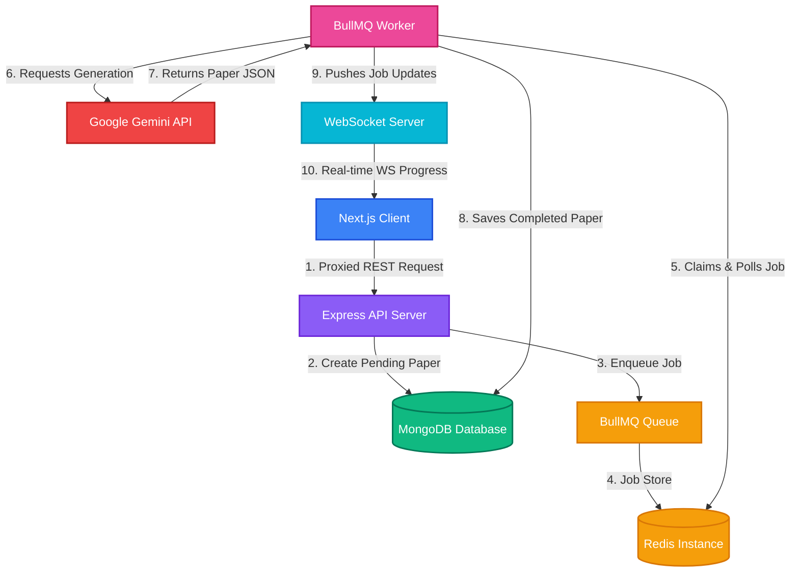
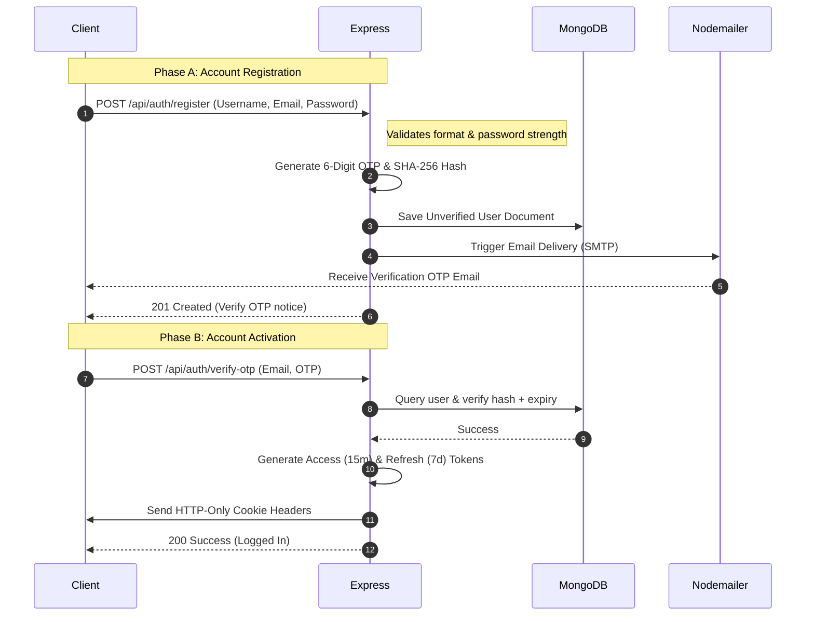
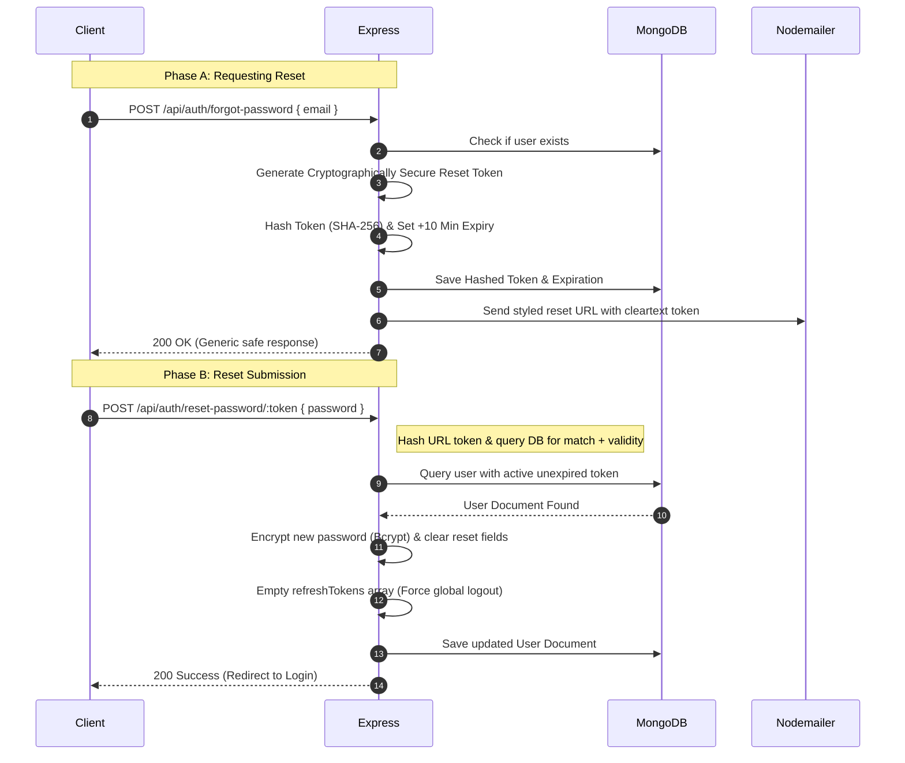
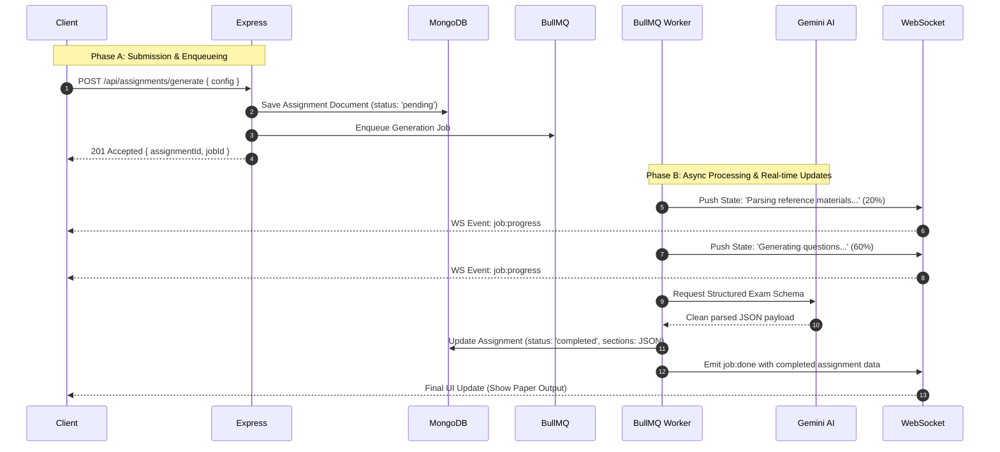

# 🌌 Veda AI — Fullstack Architecture & Flow Guide

Welcome to the **Veda AI** monorepo guide. This repository contains the complete frontend and backend codebases required to run Veda AI, a smart classroom companion that generates customized academic assignments and exam question papers using Gemini 1.5.

---

## 📂 Project Structure

Both frontend and backend are housed within this single repository:

```
veda_ai_workspace/
├── veda_ai/               # Next.js Frontend App
└── veda_ai_backend/       # Node.js Express Backend API
```

---

## ⚙️ How to Push to GitHub Securely

To prevent exposing configuration files (like `.env` containing your Gemini API key, database credentials, or email credentials), a root `.gitignore` is active at the workspace level.

### Step 1: Initialize Git at the Workspace Root
If you haven't already initialized Git in the root directory:
```bash
# In c:\Users\Lenovo\OneDrive\Desktop\PROJECTS
git init
```

### Step 2: Configure Environment Templates
Always share environment schemas without the actual values. Create `.env.example` files in both frontend and backend directories:

#### **Backend (`veda_ai_backend/.env.example`)**
```env
PORT=5000
MONGO_URI=mongodb://127.0.0.1:27017/veda_ai
JWT_SECRET=your_jwt_secret
JWT_REFRESH_SECRET=your_jwt_refresh_secret
NODE_ENV=development
SMTP_USER=your_email@gmail.com
SMTP_PASS="your_app_password"
REDIS_URL=redis://127.0.0.1:6379
GEMINI_API_KEY=your_gemini_api_key
WS_PORT=8080
FRONTEND_URL=http://localhost:3000
```

#### **Frontend (`veda_ai/.env.example`)**
```env
# The backend URL that Next.js will proxy requests to (resolves CORS and cookie issues)
NEXT_PUBLIC_API_URL=http://localhost:5000/api
NEXT_PUBLIC_WS_URL=ws://localhost:8080
```

### Step 3: Push to GitHub
Now you can add, commit, and push your repository. The `.gitignore` will guarantee `.env` and `node_modules` remain on your local machine:
```bash
git add .
git commit -m "feat: implement password reset flow and rate limiting"
git remote add origin <your-github-repo-url>
git branch -M main
git push -u origin main
```

---

## 🏛️ System Architecture & Data Flow

### Architecture Overview
```txt
Teacher
   │
   ▼
Next.js Frontend (Zustand, Websockets)
   │
   ▼ (Next.js API Proxy Rewrite)
Express API Gateway
   │
   ▼ (Job Enqueued)
BullMQ Queue
   │
   ▼
Redis (Job Store)
   │
   ▼ (Claim Job)
BullMQ Worker
   │
   ▼ (Generate Structured Exam Paper)
Google Gemini AI 1.5
   │
   ▼ (Save Result)
MongoDB
   │
   ▼ (Emit Completed Status)
WebSocket Server
   │
   ▼ (Real-time Progress & Final Output Page)
Teacher
```

### Why Queue-Based Processing?

LLM generation tasks can take anywhere from 10 to 30+ seconds to complete. Keeping a synchronous HTTP request open for that duration causes server timeouts, prevents concurrency, and wastes CPU cycles. 

To solve this, Veda AI uses a decoupled **BullMQ + Redis** queue structure:
- **Zero Timeout Risks**: The Express API receives the request, writes a `pending` assignment to MongoDB, enqueues the job in Redis, and instantly returns `201 Accepted`.
- **Concurrent Scaling**: Redis acts as a state store allowing workers to scale horizontally across servers or threads without blocking main API routes.
- **Real-Time Client Updates**: A background worker claims the task, posts step-by-step progress metrics to a WebSocket connection, and saves the final JSON schemas directly to the DB on completion.

---

Veda AI utilizes a modern, decoupled asynchronous stack designed for heavy compute tasks (AI generation):



### Next.js API Proxy (CORS & Cookie Solution)
Veda AI utilizes Next.js API proxy rewrites (configured in `next.config.ts`) to route frontend requests (e.g., `/api/login`) directly to the backend (`http://localhost:5000/api/login`). 
This guarantees that the browser views the frontend and backend as the exact same origin, which natively solves cross-origin restrictions and allows strict `HttpOnly` and `SameSite=Strict` session cookies to work flawlessly on strict mobile browsers (like iOS Safari with Intelligent Tracking Prevention).

---

## 🔄 Core Flows Breakdown

### 1. User Authentication & OTP Flow


### 2. Password Reset Flow (Secure Token)


### 3. Asynchronous Question Paper Generation Flow


---

## 🔒 Security Measures Configured

1. **Rate Limiting (`express-rate-limit`)**:
   - Limit: **5 requests per 15 minutes** per IP.
   - Applied to critical endpoints: `/register`, `/verify-otp`, `/resend-otp`, `/forgot-password`, `/reset-password/:token`.
   - Prevents brute-forcing verification codes and spamming SMTP email resources.

2. **Secure Passwords**:
   - Enforced password requirements: minimum 8 characters, at least 1 uppercase letter, 1 lowercase letter, 1 number, and 1 special character.
   - Automatically encrypted with `bcryptjs` before storage.

3. **HTTP-Only Cookies**:
   - Access and Refresh tokens are transmitted strictly via client-inaccessible, HTTP-only cookies to eliminate XSS token theft.

4. **Refresh Token Rotation**:
   - Tokens rotated on every refresh request. Reuse attacks are automatically detected and invalidate all active user sessions instantly.

---

## 🛠️ Detailed Tech Stack

| Layer | Frontend (`veda_ai`) | Backend (`veda_ai_backend`) |
|---|---|---|
| **Core Framework** | Next.js 15 (React 19) | Node.js, Express.js |
| **Language** | TypeScript | JavaScript (ES Modules) |
| **Styling / UI** | TailwindCSS | N/A |
| **Database** | N/A | MongoDB, Mongoose ORM |
| **Cache / Queue** | N/A | Redis (IORedis), BullMQ |
| **AI Integration** | N/A | Google Gen AI SDK (`gemini-1.5-flash`) |
| **Real-time** | WebSocket (native Browser API) | `ws` (WebSocket Server Library) |
| **Authentication** | Cookie-based Session State | JWT (jsonwebtoken), bcryptjs |
| **Emails** | N/A | Nodemailer (SMTP Service) |

---

## 🚀 Local Installation & Setup Guide

Ensure you have **Node.js (v18+)**, **MongoDB**, and **Redis** running on your local machine.

### 1. Clone & Workspace Setup
```bash
git clone <your-repo-url> veda_ai_workspace
cd veda_ai_workspace
```

### 2. Backend Installation & Setup
```bash
cd veda_ai_backend
npm install

# Create env file from example
copy .env.example .env
# Open .env and fill in:
# - MONGO_URI, REDIS_URL
# - SMTP_USER & SMTP_PASS (Gmail App Password for sending OTPs)
# - GEMINI_API_KEY (from Google AI Studio)

# Run server in dev mode
npm run dev
```

### 3. Frontend Installation & Setup
```bash
cd ../veda_ai
npm install

# Create local env file
copy .env.example .env.local

# Run next dev server
npm run dev
```

The frontend will run on `http://localhost:3000` and communicate with the backend running on `http://localhost:5000` using the Next.js API Proxy (configured in `next.config.ts`).

---

## 📋 API Reference

### 🔐 Authentication Endpoints

| Method | Endpoint | Access | Description | Request Body |
|---|---|---|---|---|
| `POST` | `/api/auth/register` | Public (Rate Limited) | Register account & trigger OTP email | `{ username, email, password }` |
| `POST` | `/api/auth/verify-otp` | Public (Rate Limited) | Verify registration OTP code & log in | `{ email, otp }` |
| `POST` | `/api/auth/resend-otp` | Public (Rate Limited) | Request a new verification OTP code | `{ email }` |
| `POST` | `/api/auth/login` | Public | Validate credentials & set auth cookies | `{ email, password }` |
| `POST` | `/api/auth/refresh` | Public | Rotates Refresh Token & gets new Access Token | *None (Reads Cookies)* |
| `POST` | `/api/auth/forgot-password` | Public (Rate Limited) | Generate secure reset token & send email | `{ email }` |
| `POST` | `/api/auth/reset-password/:token`| Public (Rate Limited) | Verify reset token & apply new password | `{ password }` |
| `GET` | `/api/auth/profile` | Protected | Fetch current user's profile | *None (Bearer Cookies)* |
| `PUT` | `/api/auth/profile` | Protected | Update profile fields | `{ fullName, schoolName, subjects... }` |
| `POST` | `/api/auth/logout` | Public | Clear cookies & revoke token in database | *None (Reads Cookies)* |

### 📝 Assignment Endpoints

| Method | Endpoint | Access | Description | Request Body |
|---|---|---|---|---|
| `POST` | `/api/assignments/generate` | Protected | Submit paper parameters and enqueue job | `{ title, subject, difficulty, questionRows }` |
| `GET` | `/api/assignments` | Protected | List user assignments sorted by creation | *None* |
| `GET` | `/api/assignments/:id` | Protected | Retrieve completed assignment document | *None* |
| `DELETE`| `/api/assignments/:id` | Protected | Delete assignment document | *None* |

---

## 🍪 Cookie Security Architecture

Veda AI implements double-cookie token authentication utilizing two separate JWT tokens:

### 1. Cookies Configuration Details

* **`accessToken`**:
  * **Role**: Primary session authorization.
  * **Payload**: Contains `userId`.
  * **Lifespan**: **15 Minutes** (Short-lived to minimize hijack window).
  * **Attributes**:
    * `httpOnly: true` (Blocks JS access, stops XSS).
    * `secure: true` (Transmitted only over HTTPS; set in production).
    * `sameSite: 'strict'` (Blocks Cross-Site Request Forgery - CSRF).

* **`refreshToken`**:
  * **Role**: Obtains new `accessToken` and `refreshToken` silently when the access token expires.
  * **Payload**: Contains `userId`.
  * **Lifespan**: **7 Days** (Longer lived).
  * **Attributes**: Configured identically to the `accessToken` (`httpOnly`, `secure`, `sameSite`).

### 2. Token Refresh & Rotation Flow
```
Client Request (Expired accessToken)
       │
       ▼
POST /api/auth/refresh (Sends HTTP-only refreshToken)
       │
       ├─► Validates token signatures and database entries
       │
       ├─► Invalides old refreshToken
       │
       ├─► Issues New rotated refreshToken (Adds to database)
       │
       ├─► Issues New short-lived accessToken
       │
       ▼
200 Success Response (Sets cookies)
```

If a compromised refresh token is reused, the backend immediately detects that the token has already been rotated. As a security mechanism, it **invalidates all active refresh tokens for that user**, forcing a clean logout across all devices.

